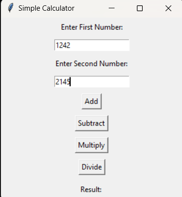
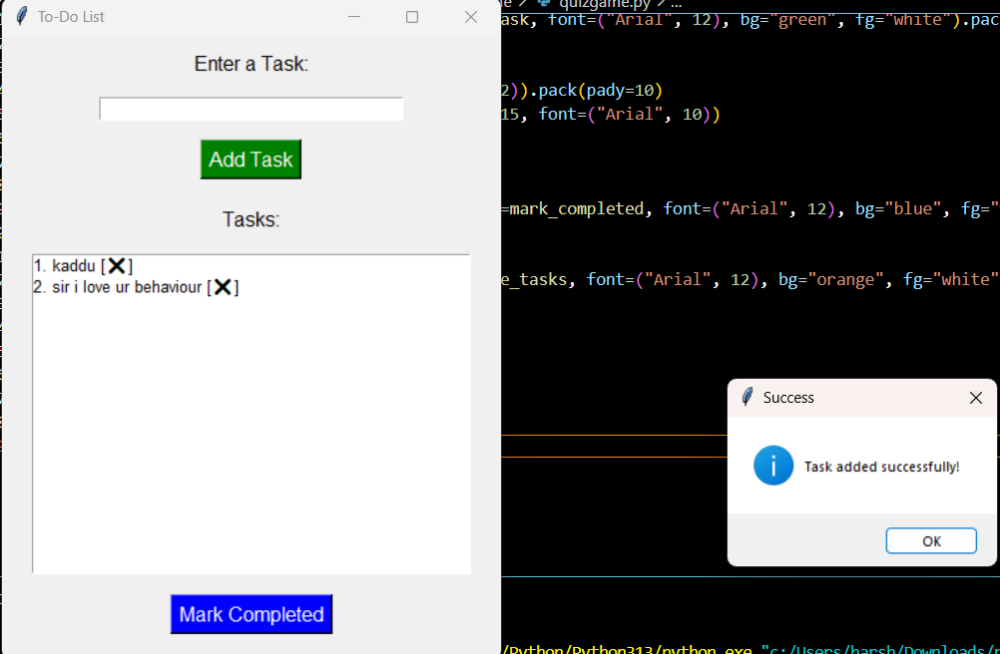

# Harsh-chaudhary.github.io

## Welcome to my GitHub Pages site! Here, you'll find a collection of my personal projects, ranging from games to utility tools. Feel free to explore and use the tools I've built. 🎉

## 🚀 **Projects**

### 1. [GUI Calculator](https://github.com/harshchaudhary31/GUI-Calculator/)

A graphical user interface (GUI)-based calculator that performs basic arithmetic operations such as addition, subtraction, multiplication, and division.

---

### 2. [To Do List](https://github.com/harshchaudhary31/Todolist/)

A GUI application to manage daily tasks. Users can add, view, and mark tasks as completed. Tasks persist between sessions.

---

### 3. [Quiz Game](https://github.com/harshchaudhary31/quizgame/)

A fun and interactive quiz game where players answer multiple-choice questions. The game keeps track of the user's score and provides immediate feedback on each answer.

---

### 4. [Expenses Manager](https://github.com/harshchaudhary31/expensesmanager/)

A simple GUI application to track and manage expenses. Users can add expenses, view their expense history, and save data for future use.

---

## 🌟 **Explore More**

Visit [Harsh Chaudhary's GitHub Profile](https://github.com/harshchaudhary31/) for more repositories and updates.

---
